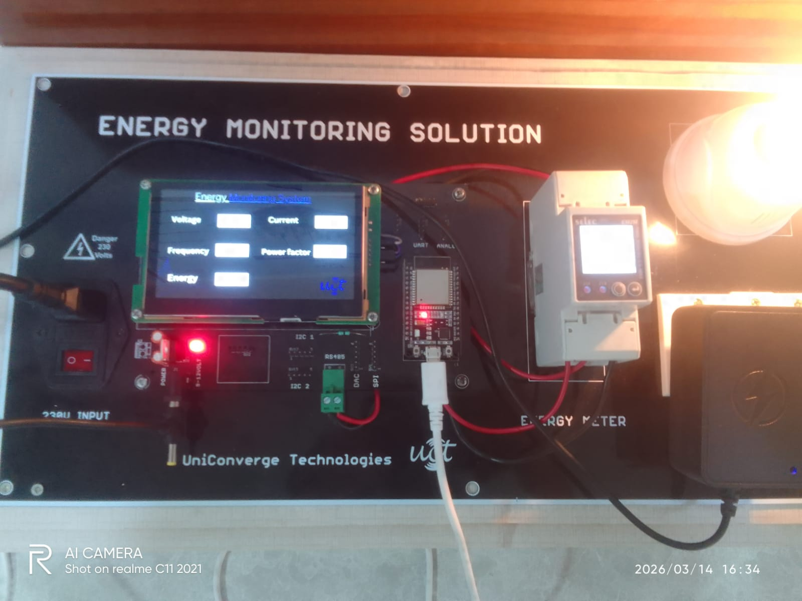
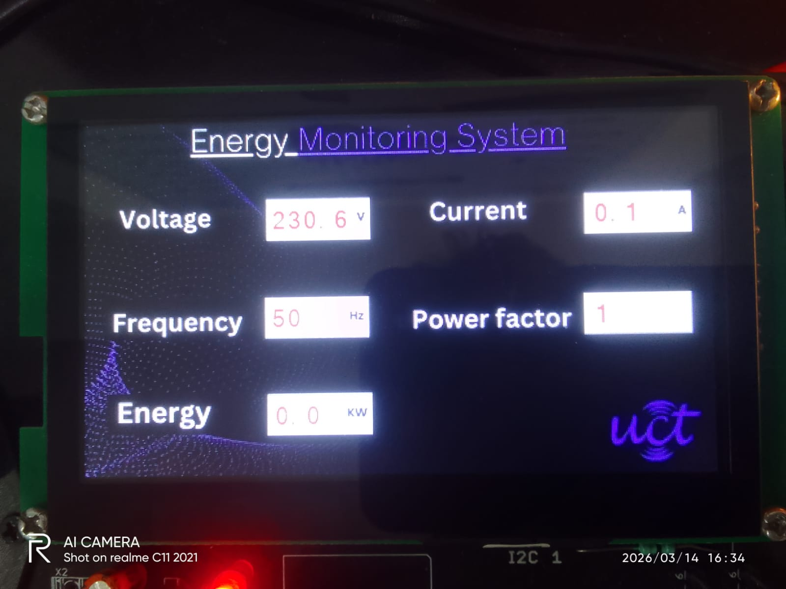
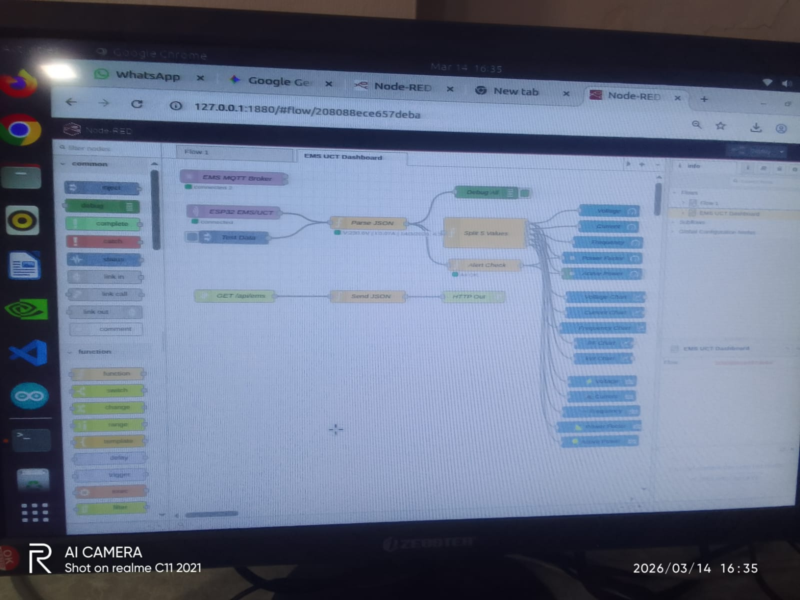
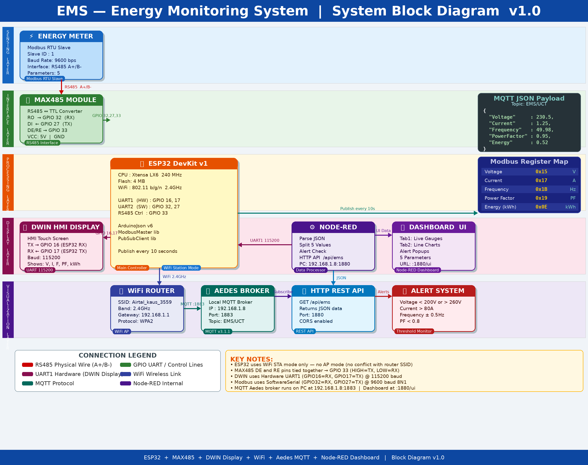
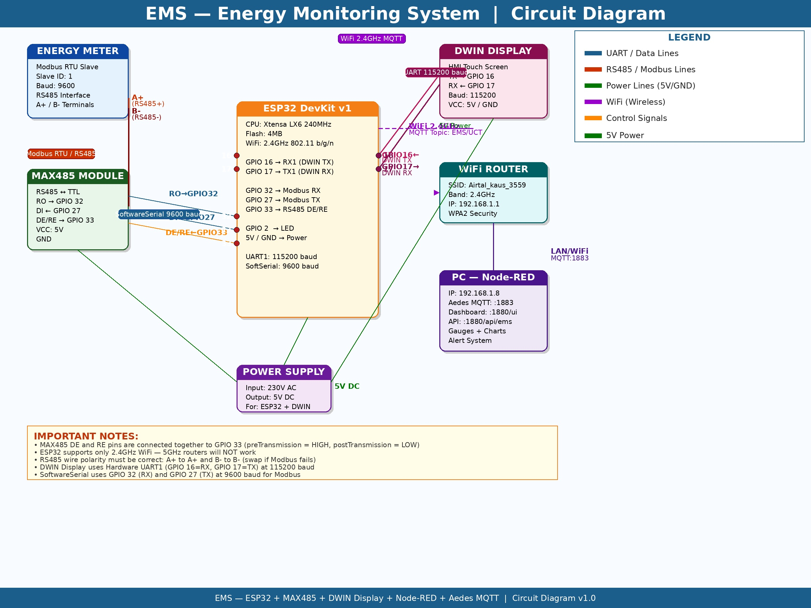

<div align="center">

# ⚡ Energy Monitoring System (EMS)


<br/>


<br/>

> **A complete IoT-based real-time energy monitoring solution using ESP32, Modbus RTU, MQTT, and Node-RED Dashboard with local DWIN HMI Display.**

<br/>

[](https://github.com/Ramsudarshanmaurya)
[](https://linkedin.com/in/ramsudarshanmaurya)
[](https://ramsudarshanmaurya.engineer/)

</div>

---

## 📸 Project Gallery

<div align="center">

| Hardware Setup | DWIN Display | Node-RED Dashboard |
|:-:|:-:|:-:|
|  |  |  |
| ESP32 + MAX485 + Energy Meter | Live HMI Display | Live Gauges |

| Block Diagram | Circuit Diagram |
|:-:|:-:|
|  |  |
| System Architecture | Complete Wiring |

</div>

---

## 📋 Table of Contents

- [⚡ Overview](#-overview)
- [✨ Features](#-features)
- [🏗️ System Architecture](#️-system-architecture)
- [🔧 Hardware Components](#-hardware-components)
- [📌 Pin Connections](#-pin-connections)
- [💻 Software Stack](#-software-stack)
- [📡 Communication Protocols](#-communication-protocols)
- [🗺️ Modbus Register Map](#️-modbus-register-map)
- [📊 Dashboard](#-dashboard)
- [⚠️ Alert System](#️-alert-system)
- [🌐 Network Configuration](#-network-configuration)
- [🚀 Getting Started](#-getting-started)
- [📁 Project Structure](#-project-structure)
- [🔮 Future Enhancements](#-future-enhancements)
- [👨‍💻 Author](#-author)

---

## ⚡ Overview

The **Energy Monitoring System (EMS)** is a complete **Industrial IoT solution** that monitors electrical parameters of loads in real-time. The system reads data from a **Modbus RTU energy meter** using an **ESP32 microcontroller**, transmits data wirelessly via **WiFi + MQTT**, and visualizes it on a **Node-RED dashboard**. A local **DWIN HMI display** shows live readings on-site.

```
📊 5 Parameters  |  🔄 10s Update Rate  |  📡 WiFi + MQTT  |  🖥️ Local HMI  |  🚨 Smart Alerts
```

---

## ✨ Features

<table>
<tr>
<td>

### 📡 Data Acquisition
- ✅ Modbus RTU over RS485
- ✅ 5 electrical parameters
- ✅ 10-second update rate
- ✅ IEEE 754 float conversion

</td>
<td>

### 🖥️ Local Display
- ✅ DWIN HMI Touch Screen
- ✅ Real-time value updates
- ✅ UART @ 115200 baud
- ✅ 5 VP address mapping

</td>
<td>

### 🌐 IoT Connectivity
- ✅ WiFi 2.4GHz (STA mode)
- ✅ MQTT publish/subscribe
- ✅ Aedes local broker
- ✅ Auto reconnect

</td>
</tr>
<tr>
<td>

### 📊 Dashboard
- ✅ Live circular gauges
- ✅ Historical line charts
- ✅ Numeric text display
- ✅ 2-tab layout

</td>
<td>

### 🚨 Alert System
- ✅ Voltage range check
- ✅ Current overload
- ✅ Frequency instability
- ✅ Low power factor

</td>
<td>

### 🌐 HTTP API
- ✅ REST GET endpoint
- ✅ JSON response
- ✅ CORS enabled
- ✅ Latest data access

</td>
</tr>
</table>

---

## 🏗️ System Architecture

```
┌─────────────────────────────────────────────────────────────────────────┐
│                    EMS SYSTEM ARCHITECTURE                              │
├─────────────────────────────────────────────────────────────────────────┤
│                                                                         │
│  ┌──────────────┐    RS485     ┌──────────────┐    UART     ┌────────┐ │
│  │ ENERGY METER │◄────────────►│   MAX485     │◄───────────►│ ESP32  │ │
│  │ Modbus Slave │   A+ / B-   │  RS485↔TTL   │  GPIO32,27  │DevKit  │ │
│  │  Slave ID:1  │              │  GPIO33(DE)  │             │        │ │
│  └──────────────┘              └──────────────┘             │        │ │
│                                                             │        │ │
│  ┌──────────────┐    UART1                                  │        │ │
│  │    DWIN      │◄────────────────────────────────────────►│        │ │
│  │   Display    │  GPIO16(RX) GPIO17(TX) @ 115200          │        │ │
│  │  HMI Touch   │                                          └───┬────┘ │
│  └──────────────┘                                              │      │
│                                                          WiFi  │      │
│                                                         2.4GHz │      │
│                                                                ▼      │
│  ┌──────────────┐  MQTT:1883  ┌──────────────┐   LAN  ┌──────────┐  │
│  │   NODE-RED   │◄────────────│ AEDES BROKER │◄───────│  ROUTER  │  │
│  │  Dashboard   │  Topic:     │ 192.168.1.8  │        │192.168.  │  │
│  │  :1880/ui    │  EMS/UCT    │   Port:1883  │        │   1.1    │  │
│  └──────┬───────┘             └──────────────┘        └──────────┘  │
│         │                                                             │
│    ┌────┴──────────────────────────┐                                 │
│    ▼              ▼                ▼                                  │
│ ┌──────┐    ┌──────────┐    ┌──────────┐                            │
│ │Gauge │    │  Charts  │    │  Alerts  │                            │
│ │  UI  │    │ Tab View │    │  Popup   │                            │
│ └──────┘    └──────────┘    └──────────┘                            │
└─────────────────────────────────────────────────────────────────────────┘
```

---

## 🔧 Hardware Components

| # | Component | Model | Qty | Purpose |
|:-:|:----------|:------|:---:|:--------|
| 1 | 🧠 ESP32 DevKit | ESP32-WROOM-32 | 1 | Main IoT Controller |
| 2 | ⚡ Energy Meter | Modbus RTU Type | 1 | Measure Electrical Parameters |
| 3 | 🔌 MAX485 Module | RS485 to TTL | 1 | RS485 Interface |
| 4 | 🖥️ DWIN Display | HMI Touch Screen | 1 | Local Real-time Display |
| 5 | 📶 WiFi Router | 2.4GHz Router | 1 | Wireless Network |
| 6 | ⚙️ Power Supply | 5V DC Adapter | 1 | Power for ESP32 |
| 7 | 💻 PC / Laptop | Linux/Windows | 1 | Node-RED Host |
| 8 | 🔗 Jumper Wires | M-F Set | Set | Connections |

---

## 📌 Pin Connections

### 🖥️ DWIN Display ↔ ESP32

| DWIN Pin | ESP32 Pin | GPIO | Signal |
|:---------|:----------|:----:|:-------|
| TX | RX1 (U1RXD) | **GPIO 16** | DWIN → ESP32 |
| RX | TX1 (U1TXD) | **GPIO 17** | ESP32 → DWIN |
| VCC | 5V | 5V | Power |
| GND | GND | GND | Ground |

### 🔌 MAX485 Module ↔ ESP32

| MAX485 Pin | ESP32 Pin | GPIO | Signal |
|:-----------|:----------|:----:|:-------|
| RO (Receive Out) | Custom RX | **GPIO 32** | RS485 → ESP32 |
| DI (Data Input) | Custom TX | **GPIO 27** | ESP32 → RS485 |
| DE (Driver Enable) | Control | **GPIO 33** | TX Enable |
| RE (Receiver Enable) | Control | **GPIO 33** | RX Enable (tied to DE) |
| VCC | 5V | 5V | Power |
| GND | GND | GND | Ground |

### ⚡ MAX485 ↔ Energy Meter

| MAX485 | Energy Meter | Description |
|:-------|:-------------|:------------|
| **A+** | A+ | RS485 Positive Line |
| **B-** | B- | RS485 Negative Line |

### 🔌 Complete Wiring

```
ESP32 DevKit
├── GPIO 16 (RX1) ──────────────→ DWIN Display TX
├── GPIO 17 (TX1) ──────────────→ DWIN Display RX
├── GPIO 32       ──────────────→ MAX485 RO
├── GPIO 27       ──────────────→ MAX485 DI
├── GPIO 33       ──────────────→ MAX485 DE + RE (tied)
├── 5V            ──────────────→ DWIN VCC + MAX485 VCC
└── GND           ──────────────→ DWIN GND + MAX485 GND

MAX485
├── A+  ──────────────────────→ Energy Meter A+
└── B-  ──────────────────────→ Energy Meter B-
```

---

## 💻 Software Stack

| Layer | Technology | Version | Purpose |
|:------|:-----------|:-------:|:--------|
| Firmware | Arduino IDE (C++) | 2.x | ESP32 Programming |
| IoT Protocol | MQTT (PubSubClient) | 2.8+ | Data Publishing |
| Serial Protocol | Modbus RTU (ModbusMaster) | 2.0.1 | Meter Reading |
| Data Format | ArduinoJson | 6.x | JSON Serialization |
| Dashboard | Node-RED | 3.x | Visualization |
| MQTT Broker | Aedes (Node-RED) | Latest | Local Broker |
| UI Framework | node-red-dashboard | 3.x | Gauges & Charts |

### 📦 Arduino Libraries

```cpp
#include <WiFi.h>           // WiFi connection
#include <PubSubClient.h>   // MQTT client
#include <ModbusMaster.h>   // Modbus RTU master
#include <ArduinoJson.h>    // JSON v6+
#include <SoftwareSerial.h> // Modbus UART
#include <HardwareSerial.h> // DWIN UART
```

---

## 📡 Communication Protocols

### 1️⃣ Modbus RTU (RS485)

```
┌─────────────────────────────────────┐
│         MODBUS RTU CONFIG           │
├─────────────────┬───────────────────┤
│ Baud Rate       │ 9600 bps          │
│ Data Bits       │ 8                 │
│ Parity          │ None              │
│ Stop Bits       │ 1 (8N1)           │
│ Slave ID        │ 1                 │
│ Function Code   │ 0x04 (Read Input) │
└─────────────────┴───────────────────┘
```

### 2️⃣ MQTT Protocol

```
┌─────────────────────────────────────┐
│           MQTT CONFIG               │
├─────────────────┬───────────────────┤
│ Broker          │ Aedes (Local)     │
│ Host            │ 192.168.1.8       │
│ Port            │ 1883              │
│ Topic           │ EMS/UCT           │
│ QoS             │ 0                 │
│ Publish Rate    │ Every 10 seconds  │
└─────────────────┴───────────────────┘
```

### 3️⃣ MQTT JSON Payload

```json
{
  "Voltage"     : 230.5,
  "Current"     : 1.25,
  "Frequency"   : 49.98,
  "PowerFactor" : 0.95,
  "Energy"      : 0.52
}
```

---

## 🗺️ Modbus Register Map

| Parameter | Register (Hex) | Register (Dec) | Data Type | Unit |
|:----------|:--------------:|:--------------:|:----------|:----:|
| ⚡ Voltage | `0x15` | 21 | 32-bit IEEE Float | V |
| 🔌 Current | `0x17` | 23 | 32-bit IEEE Float | A |
| 〰️ Frequency | `0x1B` | 27 | 32-bit IEEE Float | Hz |
| 📐 Power Factor | `0x19` | 25 | 32-bit IEEE Float | PF |
| 🔋 Active Energy | `0x0E` | 14 | 32-bit Float (Swapped) | kWh |

### 🖥️ DWIN VP Address Map

| Parameter | VP Address | Unit |
|:----------|:----------:|:----:|
| Voltage | `0x64` | V |
| Frequency | `0x65` | Hz |
| Energy | `0x66` | kWh |
| Current | `0x67` | A |
| Power Factor | `0x68` | PF |

---

## 📊 Dashboard

### Tab 1 — ⚡ Live Dashboard

| Gauge | Min | Max | Yellow | Red | Unit |
|:------|:---:|:---:|:------:|:---:|:----:|
| Voltage | 0 | 300 | 200 | 260 | V |
| Current | 0 | 100 | 50 | 80 | A |
| Frequency | 45 | 55 | 49 | 51 | Hz |
| Power Factor | 0 | 1 | 0.7 | 0.9 | PF |
| Active Power | 0 | 50 | 20 | 40 | kW |

### Tab 2 — 📈 Historical Charts

| Chart | Y-Min | Y-Max | Color | Points |
|:------|:-----:|:-----:|:-----:|:------:|
| Voltage (V) | 200 | 260 | `#00d4ff` 🔵 | 60 |
| Current (A) | 0 | 50 | `#ff6b35` 🟠 | 60 |
| Frequency (Hz) | 49 | 51 | `#a8ff3e` 🟢 | 60 |
| Power Factor | 0 | 1 | `#ff3ecc` 🟣 | 60 |
| Active Power (kW) | 0 | 50 | `#ffd700` 🟡 | 60 |

### 🌐 Access Dashboard

```
Dashboard URL : http://127.0.0.1:1880/ui
HTTP API      : http://192.168.1.8:1880/api/ems
Node-RED      : http://127.0.0.1:1880
```

---

## ⚠️ Alert System

| Parameter | Condition | Alert Message |
|:----------|:----------|:--------------|
| ⚡ Voltage | `< 200V` or `> 260V` | `Voltage OUT OF RANGE: xxV` |
| 🔌 Current | `> 80A` | `Current HIGH: xxA` |
| 〰️ Frequency | `< 49.5Hz` or `> 50.5Hz` | `Frequency UNSTABLE: xxHz` |
| 📐 Power Factor | `< 0.8` | `Low Power Factor: x.xx` |

> 🔔 Alerts appear as **popup notifications** on the dashboard in real-time!

---

## 🌐 Network Configuration

```
┌─────────────────────────────────────────────┐
│              NETWORK TOPOLOGY               │
├──────────────┬──────────────┬───────────────┤
│ Device       │ IP Address   │ Port          │
├──────────────┼──────────────┼───────────────┤
│ WiFi Router  │ 192.168.1.1  │ —             │
│ PC (WiFi)    │ 192.168.1.8  │ 1883, 1880    │
│ ESP32        │ 192.168.1.x  │ —  (DHCP)     │
│ MQTT Broker  │ 192.168.1.8  │ 1883          │
│ Node-RED     │ 127.0.0.1    │ 1880          │
└──────────────┴──────────────┴───────────────┘
```

> ⚠️ **Important:** ESP32 supports **2.4GHz WiFi only** — 5GHz will NOT work!

---

## 🚀 Getting Started

### Prerequisites

```bash
# Arduino IDE Libraries (Install via Library Manager)
✅ PubSubClient       by Nick O'Leary
✅ ModbusMaster       by Doc Walker
✅ ArduinoJson        v6+ by Benoit Blanchon

# Node-RED Packages
✅ node-red-dashboard
✅ node-red-contrib-aedes
```

### Step 1 — ESP32 Setup

```cpp
// Update WiFi credentials in code
const char* ssid     = "YOUR_WIFI_SSID";
const char* password = "YOUR_WIFI_PASSWORD";
const char* mqtt_server = "YOUR_PC_IP";  // e.g. 192.168.1.8
```

```bash
# Upload via Arduino IDE
Board   : ESP32 Dev Module
Port    : COMx (Windows) or /dev/ttyUSB0 (Linux)
Upload Speed : 115200
```

### Step 2 — Node-RED Setup

```bash
# Install Node-RED (if not installed)
npm install -g node-red

# Start Node-RED
node-red

# Open browser
http://127.0.0.1:1880
```

### Step 3 — Import Flow

```
☰ Menu → Import → Select file → Node Red JSON file/nodered_aedes_flow.json → Import → Deploy
```

### Step 4 — View Dashboard

```
🌐 Open browser: http://127.0.0.1:1880/ui
```

### Step 5 — Verify Serial Monitor

```
✅ WiFi Connected!
✅ IP Address: 192.168.1.x
✅ MQTT Connected!
✅ Active Power (kW): xx.xx
✅ Publish message: {"Voltage":230.5,...}
```

---

## 📁 Project Structure

```
📦 Energy Monitoring System/
├── 📂 Code/
│   └── 📄 EMS_Final_Code.ino          # ESP32 Arduino Firmware
│
├── 📂 Document/
│   ├── 📄 EMS_Documentation.docx      # Full Technical Documentation
│   └── 📄 EMS_Full_Documentation.docx # English Detailed Doc
│
├── 📂 image/
│   ├── 🖼️ EMS_Block_Diagram.png       # System Block Diagram
│   ├── 🖼️ EMS_Circuit_Diagram.jpg     # Circuit Wiring Diagram
│   ├── 🖼️ image1.jpg                  # Node-RED Dashboard
│   ├── 🖼️ image2.jpg                  # Live Gauges
│   ├── 🖼️ image3.jpg                  # DWIN Display
│   ├── 🖼️ image4.jpg                  # Hardware Setup
│   └── 🖼️ image5.jpg                  # Energy Meter
│
├── 📂 Node Red JSON file/
│   └── 📄 nodered_aedes_flow.json     # Node-RED Flow Export
│
└── 📄 README.md                       # This File ← You are here!
```

---

## 🔮 Future Enhancements

- [ ] 💾 **Database Integration** — InfluxDB / MySQL for historical storage
- [ ] 📧 **Email/SMS Alerts** — Critical event notifications
- [ ] 📱 **Mobile App** — React Native / Flutter
- [ ] 💰 **Billing Calculator** — Monthly electricity bill from kWh
- [ ] 📊 **Grafana Dashboard** — Professional time-series visualization
- [ ] ☁️ **Cloud Integration** — AWS IoT / Azure IoT Hub
- [ ] 🔧 **OTA Updates** — Over-the-air ESP32 firmware updates
- [ ] 📈 **Multi-Meter Support** — Monitor multiple energy meters

---

## 🐛 Troubleshooting

| Problem | Cause | Solution |
|:--------|:------|:---------|
| WiFi not connecting | Wrong SSID or 5GHz router | Use 2.4GHz, check credentials |
| MQTT failed (rc=-2) | Wrong broker IP | Check `mqtt_server` IP |
| Modbus no data | Wrong A+/B- wiring | Swap RS485 wires |
| DWIN blank | Wrong GPIO or baud | Check GPIO 16/17, 115200 |
| Dashboard empty | MQTT disconnected | Redeploy Node-RED flow |

---

## 👨‍💻 Author

<div align="center">


### Ramsudarshan Maurya

**Embedded Systems & IoT Engineer**

*B.Tech ECE — AKTU Lucknow (2025) | CGPA: 7.4*
*UniConverge Technologies, Noida (Intern)*

[](https://github.com/Ramsudarshanmaurya)
[](https://linkedin.com/in/ramsudarshanmaurya)
[](https://ramsudarshanmaurya.engineer/)
[](mailto:ramsudarshanmaurya@gmail.com)

**Skills:** `C` `C++` `ESP32` `STM32` `FreeRTOS` `MQTT` `BLE` `Modbus` `IoT`

🏆 RoboRace 1st Prize &nbsp;|&nbsp; 📄 Published Researcher &nbsp;|&nbsp; 🟢 Open to Work

</div>

---

## 📄 License

```
MIT License — Free to use, modify, and distribute with attribution.
Copyright (c) 2025 Ramsudarshan Maurya
```


---

<div align="center">

### ⭐ If this project helped you, please give it a star!


**Made with ❤️ by [Ramsudarshan Maurya](https://github.com/Ramsudarshanmaurya)**

*ESP32 + Modbus RTU + MQTT + Node-RED = Complete EMS Solution* ⚡

</div>
